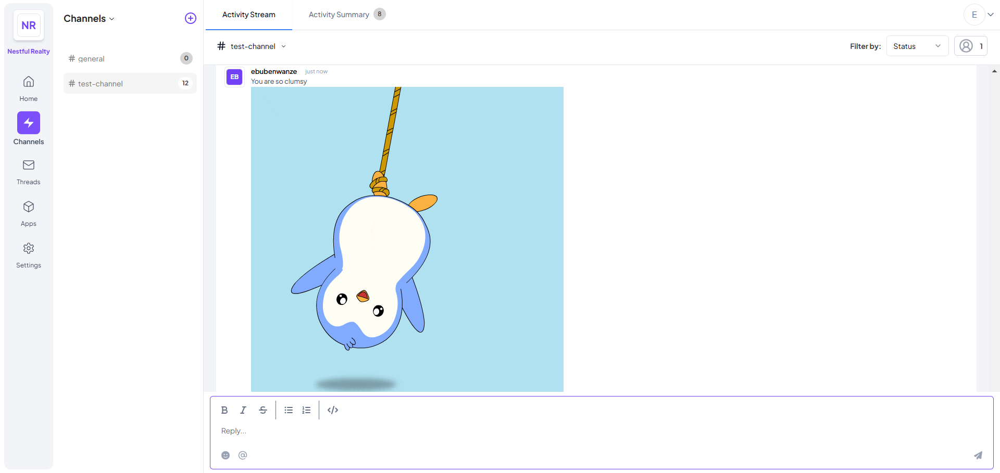

# GIF Responder Telex Integration

## 📌 Description & Purpose

GIF Responder is a Telex integration that automatically responds to messages containing specific keywords with relevant GIFs. It leverages the Giphy API to fetch GIFs based on predefined or user-configured keywords. Every message sent that has the keywords specified in the settings with return a gif relating to that word along with the original message as the modified message

## 🚀 Setup Instructions

### Prerequisites

Ensure you have the following installed:

- [Node.js](https://nodejs.org/) (version 16 or later)
- [npm](https://www.npmjs.com/) or [yarn](https://yarnpkg.com/)

### Installation

Clone the repository and install dependencies:

```sh
git clone https://github.com/poeticrow/HNG-stage-3-gif-responder-telex.git
cd HNG-stage-3-gif-responder-telex
npm install  # or yarn install
```

### Configuration

1. Create a `.env` file in the project root and add your Giphy API key:

```env
GIPHY_API_KEY=your_giphy_api_key
NODE_ENV=development
```

2. Run the development server:

```sh
npm run dev
```

## 🛠 Usage

### Webhook Endpoint

Send a `POST` request to the `/webhook` endpoint with the following payload(this comes from the channel):

```json
{
  "message": "Hello world!",
  "settings": [
    { "label": "Giphy Api Key", "default": "your_giphy_api_key" },
    { "label": "Custom Keywords", "default": "hello, world" }
  ]
}
```

**Response:**

```json
{
  "status": "success",
  "message": "<div><p>Hello world!</p><p></p></div>"
}
```

## ✅ Testing Guide

### Running Tests Locally

Run tests using Jest:

```sh
npm test
```

### Sample Test Cases

| Scenario                            | Expected Outcome                    |
| ----------------------------------- | ----------------------------------- |
| Message contains a matching keyword | Returns a message with a GIF        |
| No matching keywords                | Returns original message            |
| Missing `message` field             | Returns `400 Bad Request`           |
| Invalid `settings` format           | Returns `400 Bad Request`           |
| Missing Giphy API key               | Returns `400 Bad Request`           |
| Giphy API failure                   | Returns `500 Internal Server Error` |

## 🚀 Deployment Guide

### Deploying to Render

1. Create a new Render web service.
2. Connect the repository: `poeticrow/HNG-stage-3-gif-responder-telex`.
3. Set environment variables in the Render dashboard:
   ```sh
   GIPHY_API_KEY=your_giphy_api_key
   ```
4. Deploy the application.

## 📸 Screenshots

_Integration in a Telex Channel_

_(_

---

Made with ❤️ for Telex 🚀
